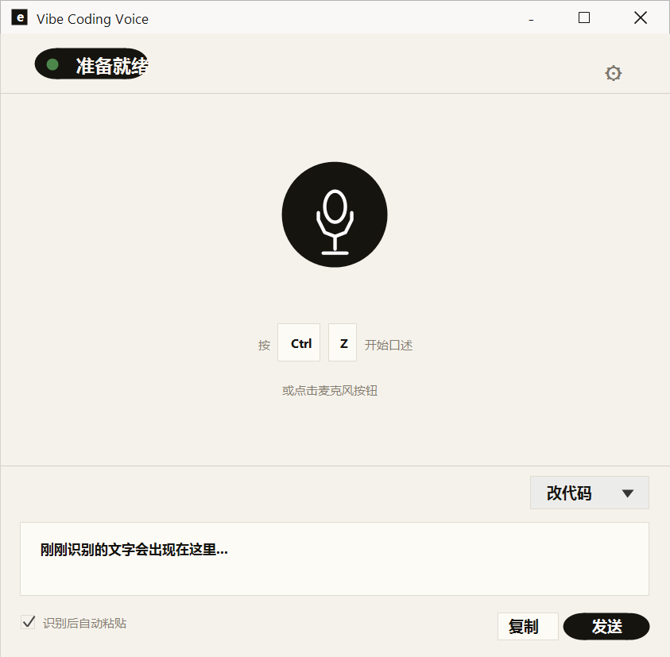
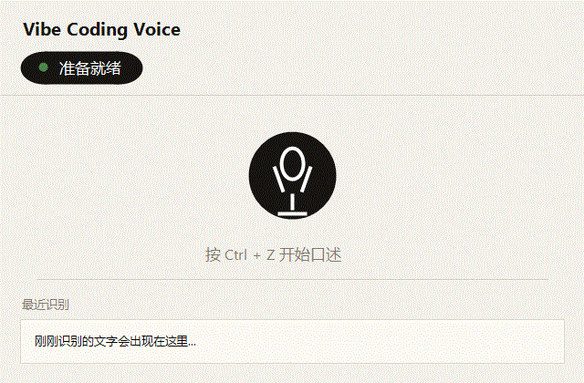

# Vibe Coding Voice Native

[English README](README.en.md)

Vibe Coding Voice Native 是一个面向开发者的 Windows 本地语音输入工具。它可以从麦克风录音，使用本地 SenseVoice 兼容模型转写语音，然后把识别结果复制或发送到当前输入框。

这个项目使用 Rust 和 egui 构建，重点服务中文以及中英混合的编程口述场景。它支持全局快捷键、本地麦克风采集、轻量原生界面、录音状态浮窗，以及不主动上传音频到远端服务的本地转写流程。

## 当前状态

项目目前处于 alpha 阶段。它已经可以用于本地试用和日常自用，但模型配置、焦点恢复、安装包和发布流程还在继续完善。

## 预览





第一张图是主界面，GIF 展示了基本口述流程。

## 已支持

- Windows 10 或更高版本
- 本地麦克风输入
- 本地 SenseVoice 兼容模型转写
- 在线 Qwen-ASR Realtime 转写
- 全局快捷键开始和结束录音
- 两种输出模式：原文输出、改代码提示词
- 识别结果复制和发送
- 可选的识别后自动粘贴
- 托盘和录音浮窗基础能力
- 在设置页手动选择本地模型目录

## 暂不保证

- 自动更新
- 跨平台支持
- 内置模型下载器
- 稳定的扩展 API
- Whisper.cpp 本地后端

后续可能继续探索其他 ASR 后端，当前公开版本支持本地 SenseVoice 兼容模型和在线 Qwen-ASR Realtime。

## 功能特点

- 基于 `eframe` / `egui` 的原生桌面界面
- 使用全局快捷键控制录音
- 通过 `cpal` 采集本地麦克风音频
- 通过 `transcribe-rs` 接入 SenseVoice 兼容转写
- 内置结果编辑框、复制、发送、自动粘贴开关
- 使用 PowerShell 实现录音和处理中浮窗
- Windows 托盘集成
- 加载中文字体，避免中文界面显示异常

## 隐私与安全

- 使用本地模型时，音频设计上由你配置的本地模型处理。
- 使用在线模型时，录音音频会发送到你配置的 DashScope/Qwen-ASR Realtime 服务。
- 复制、粘贴、发送会使用剪贴板和键盘模拟能力。
- 录音浮窗通过 `recording-overlay.ps1` 启动。
- 如果要处理敏感代码、凭据或私密文档，请先审查源码、依赖和模型许可证。

## 环境要求

- Windows 10 或更高版本
- 支持 Rust 2024 edition 的稳定 Rust 工具链
- PowerShell
- 可用麦克风
- 本地 SenseVoice 兼容模型目录
- 如果使用在线模型，需要 DashScope API Key

## 下载安装

Release 页面会提供两种 Windows 包：

- `.msi`：安装版，适合普通用户。安装后从开始菜单启动。
- `.zip`：绿色版，适合想直接解压试用、手动管理文件的用户。

发布包不包含模型文件。如果使用本地模型，请参考下方“模型安装”或 [docs/MODELS.zh-CN.md](docs/MODELS.zh-CN.md) 下载模型；如果使用在线模型，请在设置里填写自己的 DashScope API Key。

## 快速开始

克隆仓库并运行：

```powershell
git clone https://github.com/YuxuanSun123/vibe-coding-voice.git
cd vibe-coding-voice
cargo run --bin vibe-coding-voice-native
```

也可以使用辅助脚本：

```powershell
.\run-native.ps1
```

开发时建议运行：

```powershell
cargo fmt --check
cargo check
cargo clippy --all-targets -- -D warnings
cargo test
```

## 模型安装

仓库不包含模型文件。你需要自行下载一个本地 SenseVoice 兼容模型，并在应用设置中指向该文件夹。

推荐模型：

```text
sherpa-onnx-sense-voice-zh-en-ja-ko-yue-int8-2024-07-17
```

官方模型说明：[sherpa-onnx SenseVoice pre-trained models](https://k2-fsa.github.io/sherpa/onnx/sense-voice/pretrained.html)。

Release 版默认优先查找程序所在目录下的模型文件夹：

```text
models/sherpa-onnx-sense-voice-zh-en-ja-ko-yue-int8-2024-07-17
```

推荐目录结构：

```text
vibe-coding-voice-native-windows-v0.1.0-alpha.1/
  vibe-coding-voice-native.exe
  models/
    sherpa-onnx-sense-voice-zh-en-ja-ko-yue-int8-2024-07-17/
      model.int8.onnx
      tokens.txt
```

开发源码运行时，也可以把模型放在仓库相邻的 `official-models` 目录：

```text
official-models/
  sherpa-onnx-sense-voice-zh-en-ja-ko-yue-int8-2024-07-17/
    model.int8.onnx
    tokens.txt
```

下载示例：

```powershell
mkdir ..\official-models
cd ..\official-models
curl.exe -L -O https://github.com/k2-fsa/sherpa-onnx/releases/download/asr-models/sherpa-onnx-sense-voice-zh-en-ja-ko-yue-int8-2024-07-17.tar.bz2
tar -xjf sherpa-onnx-sense-voice-zh-en-ja-ko-yue-int8-2024-07-17.tar.bz2
cd ..\vibe-coding-voice
```

然后打开应用：

1. 点击右上角设置图标。
2. 确认模型目录，或点击 `选择文件夹` 选择刚下载解压后的模型文件夹。
3. 点击 `检查 SenseVoice`。
4. 回到主页，开始录音。

更详细的模型下载、目录结构、兼容性和排错说明见 [docs/MODELS.zh-CN.md](docs/MODELS.zh-CN.md)。

## 在线模型

设置页可以在 `本地模型` 和 `在线模型` 之间切换。选择在线模型后，需要填写：

- DashScope API Key
- 模型名，默认 `qwen3-asr-flash-realtime`
- WebSocket 地址，默认 `wss://dashscope.aliyuncs.com/api-ws/v1/realtime`
- 语种，默认 `zh`

在线模式使用 Qwen-ASR Realtime 的 Manual 模式：录音结束后，应用会把 16 kHz PCM 音频通过 WebSocket 发送到服务端，等待最终识别结果后再复制或投送文本。

## 模型许可证

本仓库的 MIT 许可证只适用于项目源码，不适用于第三方模型权重。

使用、分发或打包模型前，请确认：

- 模型许可证
- 下载模型目录中是否包含 `LICENSE`
- 是否允许商业使用
- 是否允许再次分发
- 是否要求署名
- 转换或量化后的 ONNX 文件是否可以分享

## 第三方声明

项目使用了一些开源 Rust crate 和本地模型生态。依赖和模型边界说明见 [THIRD_PARTY_NOTICES.md](THIRD_PARTY_NOTICES.md)。

## 项目结构

```text
.
  src/
    app.rs                 主界面、设置页、录音区、结果区
    hotkeys.rs             全局快捷键注册和事件处理
    main.rs                窗口、字体、应用初始化
    sensevoice.rs          模型检测、兼容处理、转写
    services.rs            录音、转写、文本发送、浮窗编排
    state.rs               应用状态和默认值
    tray.rs                托盘集成
  assets/                  应用自带 UI 资源
  docs/                    文档和预览资源
  recording-overlay.ps1    录音状态浮窗
  run-native.ps1           本地运行脚本
  Cargo.toml
  Cargo.lock
  README.md
```

## 开发说明

主要入口：

- `src/main.rs`：应用启动、字体、原生窗口配置
- `src/app.rs`：界面布局、控件、页面、交互状态
- `src/services.rs`：录音管线、转写流程、文本投递
- `src/sensevoice.rs`：模型目录识别和转写引擎加载
- `recording-overlay.ps1`：录音或处理中使用的独立浮窗

提交 PR 前建议运行：

```powershell
cargo fmt --check
cargo check
cargo clippy --all-targets -- -D warnings
cargo test
```

## 路线图

- 改进面向普通用户的 Release 更新体验
- 增强模型设置诊断信息
- 改进录音后的输入焦点恢复
- 完善自动发布构建
- 在 Windows 工作流稳定后探索跨平台支持
- 在默认 SenseVoice 流程稳定后重新评估可选 ASR 后端

## 参与贡献

项目还很年轻，欢迎提交 issue 和 pull request。贡献前请阅读 [CONTRIBUTING.md](CONTRIBUTING.md)。

## 许可证

本项目使用 MIT 许可证。详情见 [LICENSE](LICENSE)。
